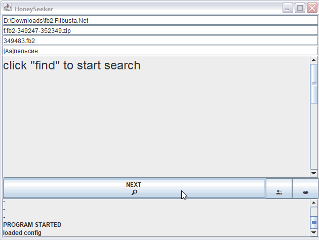

# HoneySeeker
Program for fulltext search in your fb2 books collection.

What differs it from some other that there is no indexing whatsoever. Just good old plain text search with a bit of 
regular expressions.

Let me just show you instead of telling:

Программа для полнотекстового поиска в вашей коллекции книг fb2.

Чем она отличается от других, так это тем, что в ней нет никакой индексации. Просто старый добрый текстовый поиск с небольшим количеством
регулярных выражений.

Позвольте мне просто показать вам, а не рассказывать:

